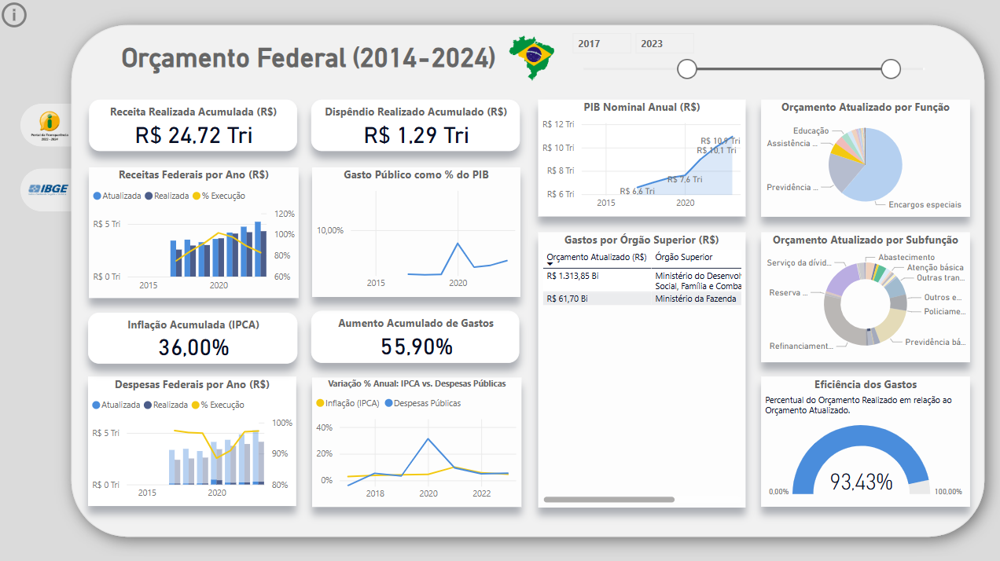
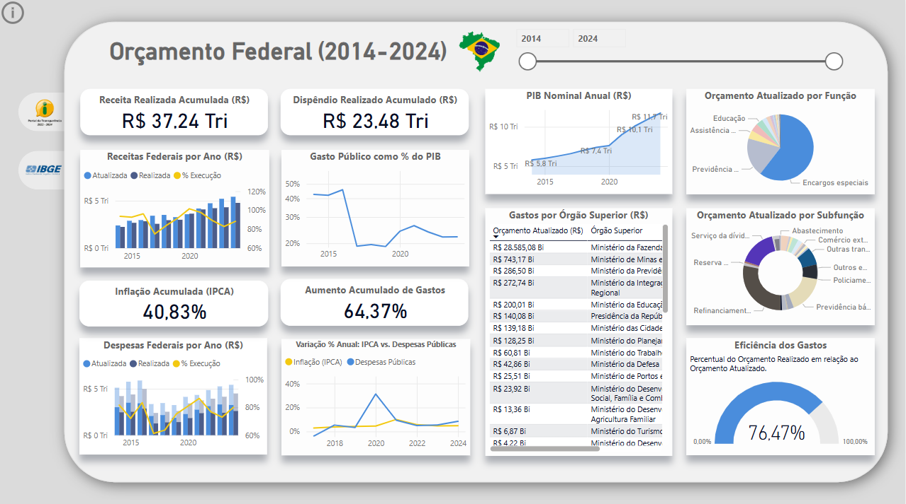
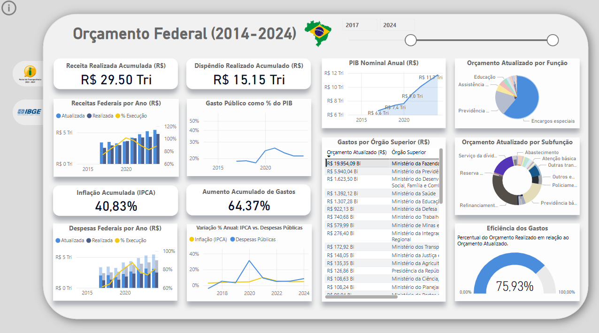

# Análise do Orçamento Público (2014-2024) com Power BI

## Sobre o Projeto
Este projeto utiliza **Power BI** para analisar a execução orçamentária e receita da União entre 2014 e 2024, assim como dados de inflação e PIB. Os dados foram extraídos do **Portal da Transparência** e do **IBGE (PIB do Brasil)**, totalizando **mais de 1.9 milhões de linhas de informações**.

## Principais Funcionalidades
- Extração e tratamento de dados (ETL)
- Criação de dashboards interativos no Power BI
- Análise da execução orçamentária ao longo dos anos
- Comparação entre orçamento e PIB
- Visualização da distribuição dos gastos por categoria
- Permite ver correlação entre aumento de gastos e inflação

## Fontes dos Dados
- [Portal da Transparência](https://portaldatransparencia.gov.br/download-de-dados)
- [IBGE - PIB](https://www.ibge.gov.br/)

## Requisitos Mínimos
Para visualizar e interagir com os dashboards, você precisará de:
- **Power BI Desktop** instalado
- Arquivo **.pbix** (disponível no repositório)
- 4 GB de memória RAM

##  Capturas de Tela
### Visão Geral do Dashboard
> 
Este dashboard exibe dados da receita e dos gastos federais acumulados dentro de um intervalo de tempo selecionável. Inclui ícones de redirecionamento pra página do IBGE e Portal da Transparência; fontes dos dados.

### Despesas do Governo com Assistência Social
A captura de tela apresenta a evolução dos gastos com Assistência Social entre 2017 e 2023. O período de maior despesa ocorreu em 2020, durante a pandemia de COVID-19, quando os gastos saltaram de 1,26% do PIB em 2019 para 5,39% em 2020.
> 

### Despesas do Governo com Previdência Social
Os gastos com Previdência Social contam com a participação de alguns ministérios, sendo os principais financiadores: Ministério da Previdência com R$ 8,4 trilhões entre 2014 e 2024, Ministério da Defesa com R$ 402 bilhões e Ministério da Educação com R$ 211 bilhões. O maior dispêndio observado em relação ao PIB ocorreu em 2017, e desde então, os gastos vêm diminuindo proporcionalmente.
> 

### Despesas do Governo com Encargos Especiais
Aproximadamente 60% dos gastos do governo são destinados a encargos especiais, sendo o Ministério da Fazenda o principal responsável, com um total de R$ 28 trilhões entre 2014 e 2024. Outros ministérios também contribuem, como o Ministério de Minas e Energia, que gastou R$ 743 bilhões no mesmo período.
> 

### Despesas do Ministério da Fazenda
A captura de tela representa os gastos do Ministério da Fazenda entre 2017 e 2024. O órgão é responsável por gastar cerca de 57% do orçamento federal, sendo praticamente tudo em encargos especiais e uma pequena contribuição na previdência social. 
> 

---

A divulgação dos dados orçamentários em gráficos traz mais transparência aos gastos públicos e o cruzamento de informações de diferentes fontes permite verificar relações de correlação e causalidade, como o aumento de gastos e a inflação.
