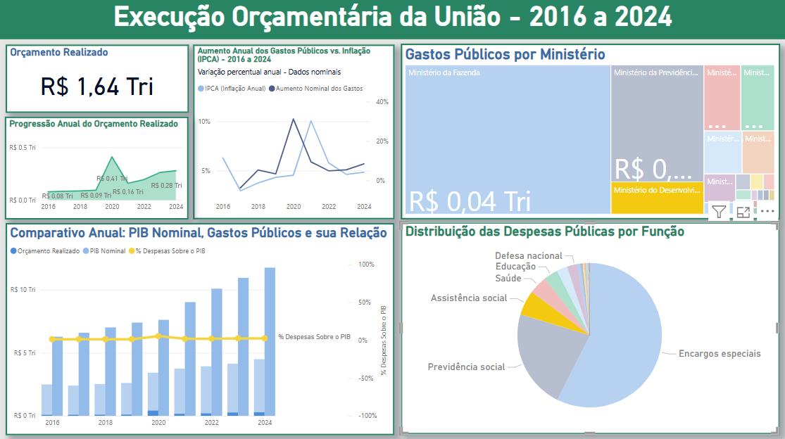
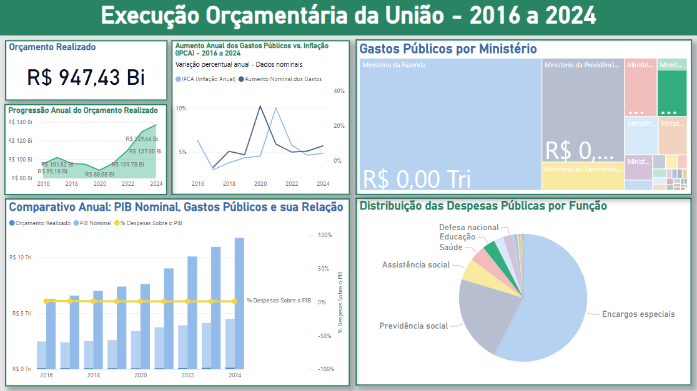
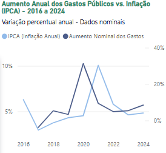
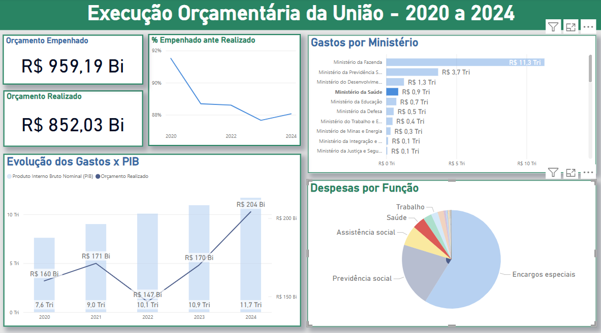

# Análise do Orçamento Público (2016-2024) com Power BI

## Sobre o Projeto
Este projeto utiliza **Power BI** para analisar a execução orçamentária da União entre 2016 e 2024, assim como dados de inflação e PIB. Os dados foram extraídos do **Portal da Transparência** e do **IBGE (PIB do Brasil)**, totalizando **mais de 233 mil linhas de informações**.

## Principais Funcionalidades
- Extração e tratamento de dados (ETL)
- Criação de dashboards interativos no Power BI
- Análise da execução orçamentária ao longo dos anos
- Comparação entre orçamento e PIB
- Visualização da distribuição dos gastos por categoria
- Permite ver correlação entre aumento de gastos e inflação

## Fontes dos Dados
- [Portal da Transparência](https://portaldatransparencia.gov.br/download-de-dados)
- [IBGE - PIB](https://www.ibge.gov.br/)

## Requisitos
Para visualizar e interagir com os dashboards, você precisará de:
- **Power BI Desktop** instalado
- Arquivo **.pbix** (disponível no repositório)

##  Capturas de Tela
### Visão Geral do Dashboard
> 

### Despesas do Governo com Assistência Social
Os gastos com Assistência Social atingiram seu pico durante a pandemia de COVID-19 em 2020, saltando de 1,26% do PIB em 2019 para 5,39% do PIB no ano seguinte.
> 

### Despesas do Governo com Educação
Cerca de um trilhão de reais foi gasto em educação no período observado, ante R$ 6,62 trilhões em Previdência Social. Proporcionalmente, gastou-se em educação o equivalente a 14% do valor aplicado em Previdência.
> 

### IPCA contra Aumento Anual dos Gastos Públicos
Naturalmente, a inflação reflete o aumento de gastos, como é possível ver no gráfico. Percebe-se que o IPCA reage de forma "lenta" em relação ao aumento do orçamento realizado: um pico de gastos antecipa, no próximo ano, um pico de inflação. 
> 

### Despesas do Ministério da Fazenda
É responsável por gastar 57% do orçamento federal, sendo praticamente tudo em encargos especiais e uma pequena contribuição na previdência social. 
> 

---

Exibição dos dados orçamentários em gráficos traz mais transparência aos gastos públicos.
