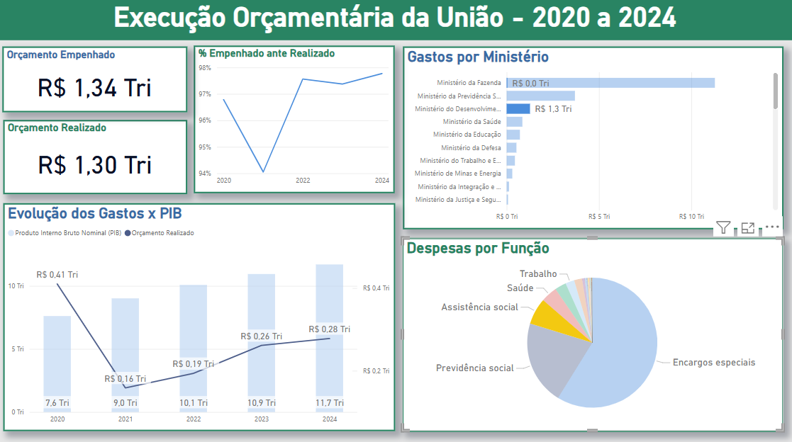
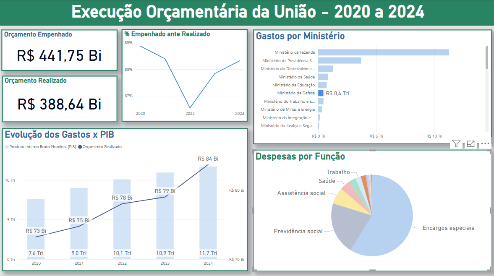

# Análise do Orçamento Público (2020-2024) com Power BI

## Sobre o Projeto
Este projeto utiliza **Power BI** para analisar a execução orçamentária da União entre 2020 e 2024. Os dados foram extraídos do **Portal da Transparência** e do **IBGE (PIB do Brasil)**, totalizando **mais de 127 mil linhas de informações**.

## Principais Funcionalidades
- Extração e tratamento de dados (ETL)
- Criação de dashboards interativos no Power BI
- Análise da execução orçamentária ao longo dos anos
- Comparação entre orçamento e PIB
- Visualização da distribuição dos gastos por categoria

## Fontes dos Dados
- [Portal da Transparência](https://portaldatransparencia.gov.br/download-de-dados)
- [IBGE - PIB](https://www.ibge.gov.br/)

## Requisitos
Para visualizar e interagir com os dashboards, você precisará de:
- **Power BI Desktop** instalado
- Arquivo **.pbix** (disponível no repositório)

##  Capturas de Tela
### Visão Geral do Dashboard
> 

### Despesas do Governo com Assistência Social (Pico na Pandemia)
> 

### Despesas do Governo com Defesa Nacional
> 

### Despesas do Ministério da Saúde (Aumento contínuo desde a Pandemia)
> 

---

Exibição dos dados orçamentários em gráficos traz mais transparência aos gastos públicos.
