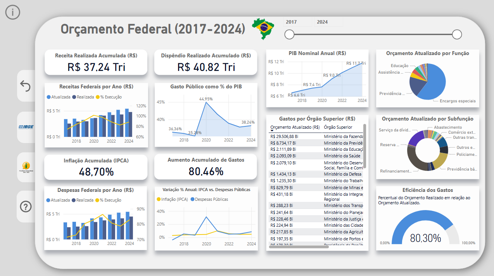
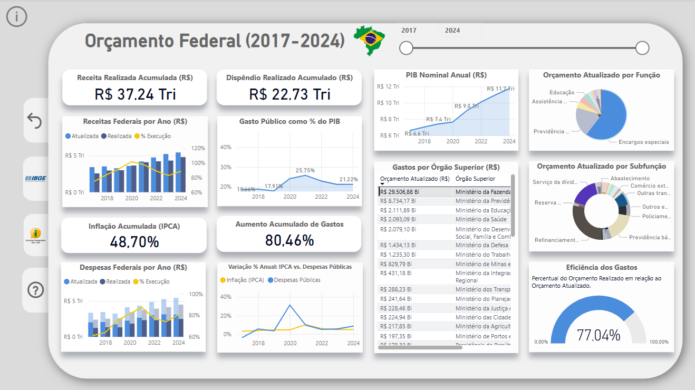

# Análise do Orçamento Público (2017-2024) com Power BI

## Sobre o Projeto
Este projeto utiliza **Power BI** para analisar a execução orçamentária e receita da União entre 2017 e 2024, assim como dados de inflação e PIB. Os dados foram extraídos do **Portal da Transparência** e do **IBGE (PIB do Brasil)**, totalizando **mais de 1.9 milhões de linhas de informações**.

## Principais Funcionalidades
- Extração e tratamento de dados (ETL)
- Criação de dashboards interativos no Power BI
- Análise da execução orçamentária ao longo dos anos
- Comparação entre orçamento e PIB
- Visualização da distribuição dos gastos por categoria
- Correlação entre aumento de gastos e inflação
- Exibição da inflação (IPCA) e do aumento de gastos acumulados

## Fontes dos Dados
- [Portal da Transparência](https://portaldatransparencia.gov.br/download-de-dados)
- [IBGE - PIB](https://www.ibge.gov.br/)

## Requisitos
Para visualizar e interagir com os dashboards, você precisará de:
- **Power BI Desktop** instalado
- Arquivo **.pbix** (disponível no repositório)
- 4 GB de memória RAM

##  Capturas de Tela
### Visão Geral do Dashboard
> 
Este dashboard exibe dados da receita e dos gastos federais acumulados dentro de um intervalo de tempo selecionável. Ele inclui ícones de redirecionamento para as páginas do IBGE e do Portal da Transparência, que são as fontes dos dados. Além disso, por meio do DAX, foi possível calcular a inflação e o aumento de gastos acumulados para qualquer período de tempo selecionado.

### Dados Orçamentários e Econômicos da Gestão Bolsonaro (2018-2022)
O painel revela que, durante o governo Bolsonaro, a inflação acumulada foi de 31,7%, enquanto os gastos aumentaram 64% e o PIB nominal em reais cresceu 44%. Como o PIB nominal é diretamente influenciado pela inflação, esse crescimento elevado pode ser explicado. Porém, em dólares e em termos reais, o PIB apresentou queda na pandemia.

É importante destacar que a pandemia pressionou o aumento de gastos devido à assistência social, como o auxílio emergencial, o que ampliou significativamente o déficit das contas públicas e impulsionou a inflação.
> 

### Dados Orçamentários e Econômicos da Gestão Lula (2023-2024)
A inflação acumulada no período foi de 9,67%, enquanto os gastos públicos cresceram 14,35%. O PIB em reais teve um aumento de 7,3%, inferior à inflação do período, o que indica uma retração na economia real do país.
> 

### Despesas do Governo com Assistência Social
A captura de tela apresenta a evolução dos gastos com Assistência Social entre 2017 e 2024. O período de maior despesa ocorreu em 2020, durante a pandemia de COVID-19, quando os gastos saltaram de 1,26% do PIB em 2019 para 5,39% em 2020.
> 

### Despesas do Governo com Previdência Social
Os gastos com Previdência Social contam com a participação de alguns ministérios, sendo os principais financiadores: Ministério da Previdência com R$ 8,4 trilhões entre 2014 e 2024, Ministério da Defesa com R$ 402 bilhões e Ministério da Educação com R$ 211 bilhões. O maior dispêndio observado em relação ao PIB ocorreu em 2017, e desde então, os gastos vêm diminuindo proporcionalmente.
> 

### Despesas do Ministério da Fazenda
A captura de tela representa os gastos do Ministério da Fazenda entre 2017 e 2024. O órgão é responsável por gastar cerca de 57% do orçamento federal, sendo praticamente tudo em encargos especiais e uma pequena contribuição na previdência social. 
> 

---

A divulgação dos dados orçamentários por meio de gráficos aumenta a transparência sobre os gastos públicos. Além disso, o cruzamento de informações de diferentes fontes possibilita a identificação de correlações e relações de causa e efeito, como o impacto do aumento de gastos na inflação.
